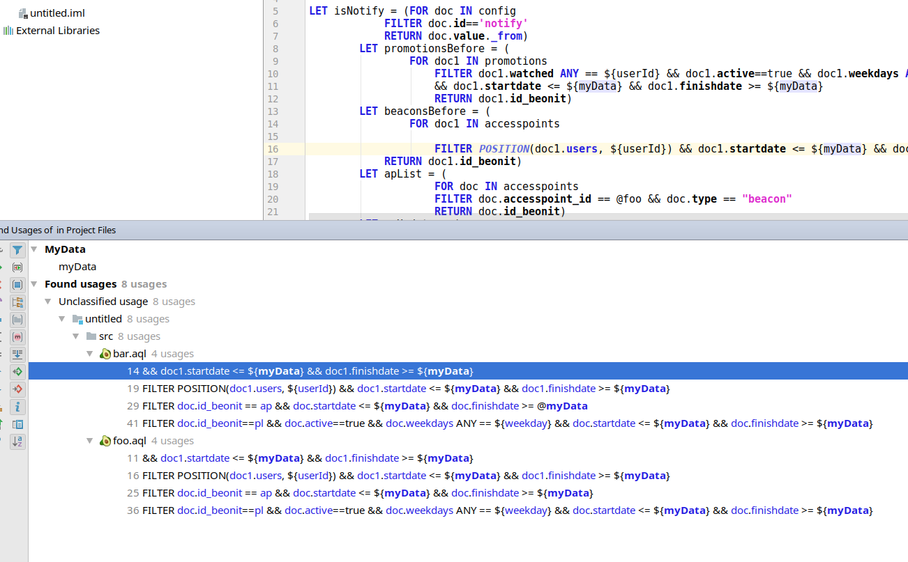
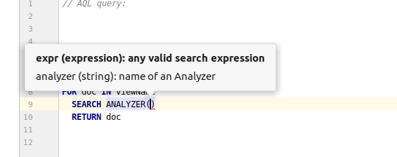
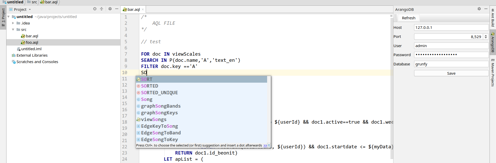
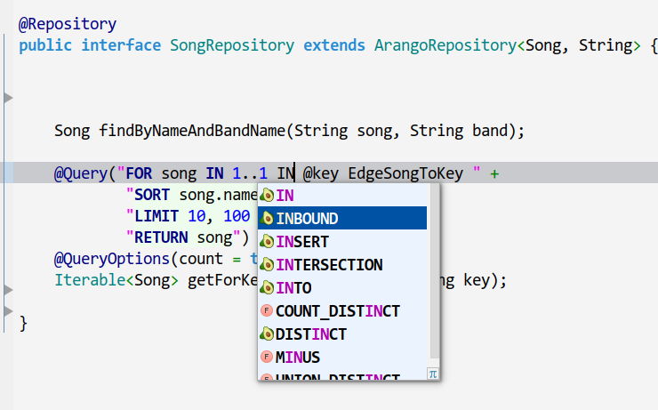

#  AQL (ArangoDB) language support plugin for Intellij IDEA 2019.2+ IDE


## Build

```
gradle build

```
Note: 
build might take a while because it downloads Intellij Community Edition (300+MB, not sure exactly)


## Run

```
gradle runIde

```


## Find usages
 



## Docs
 


## Function arguments
 



## File editing



## Parameter language injection
 



## Licence
[Apache License Version 2.0](LICENSE.txt)
