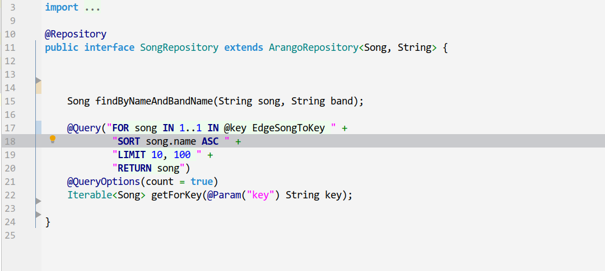

#  AQL (ArangoDB) language support plugin for Intellij IDEA 18.x IDE
(might work in other Intellij products, I compiled it with 2017 version,  but have not tested it)

## File editing


## Parameter language injection
 



## Build

```
gradle

```

## Licence
[Apache License Version 2.0](LICENSE.txt)
