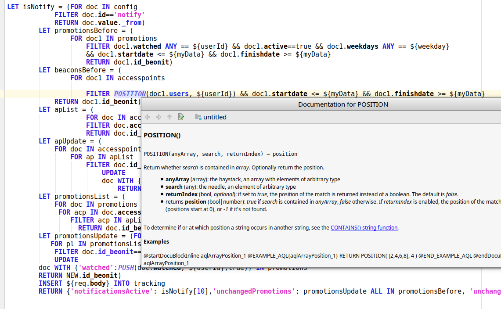

#  AQL (ArangoDB) language support plugin for Intellij IDEA 18.x IDE
(might work in other Intellij products, I compiled it with 2017 version,  but have not tested it)

## Build

```
gradle build

```
Note: 
build might take a while because it downloads Intellij Community Edition (300+MB, not sure exactly)


## Run

```
gradle runIde

```


## Find usages
 


## Docs
 



## File editing


## Parameter language injection
 


## Licence
[Apache License Version 2.0](LICENSE.txt)
